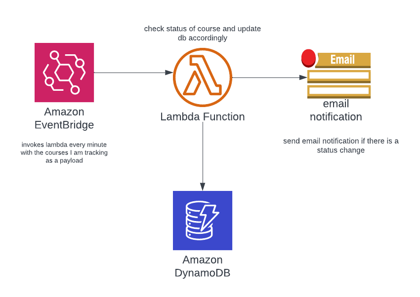

# course-grab

#### Background

Cornell AppDev's course-grab scrapes the class roster every 20 minutes to get the latest availability of courses ([source](https://github.com/cuappdev/coursegrab-backend/blob/master/src/app/coursegrab/utils/scraper.py#L27-L29)). 20 minutes is pretty long considering how quickly courses fill up.

Cornell CIT exposes an [API](https://classes.cornell.edu/content/SP22/api-details) to get the most recent data in real-time.

This a toy implemenation I spun up to track two courses i'm monitoring. In summary, it polls the API **once** every minute to see if the course is now open and sends me an email if so. My math shows this to be a 95% improvement in reaction time.

#### Architecture

